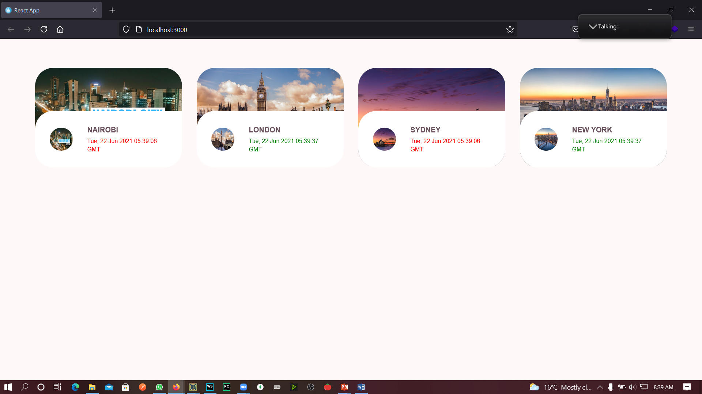

## Question 3
Using React, create a Clock component (like we did in class, or you can even use the one we did in class) that does the following:

a) The Clock should have a property that determines whether the Clock will be interactive (it changes after every second) or static. (7 marks)

b) Style the Clock component so that it makes better use of space. That is, instead of each Clock occupying the entire width of the screen, each Clock should only take as much space as it needs, thus allowing other Clocks to be rendered side by side, so long as there is space. (4 marks)

c) Style the Clock component so that interactive Clocks show in green while static clocks show in red. (6 marks)

Uploading Instructions
Create a Microsoft Word document, and attach screen-shots of the following items:
=> Your web browser showing Clocks for the following cities: Nairobi, London, Sydney, and New York.
=> Any of the development (code) files that you edited/added to satisfy the exam requirements.

Once all the necessary screen-shots have been attached, upload the Microsoft Word document (You can also convert the Microsoft Word document to a PDF document, if you want.)

## Available Scripts

In the project directory, you can run:

### `npm start`

Runs the app in the development mode.\
Open [http://localhost:3000](http://localhost:3000) to view it in the browser.

